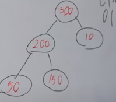

### Heap - двоичная куча

__Где можно использовать кучу?__

Представим, что у нас имеется банк, где нашей задачей является обработать счета
клиентов, которые имеют большую доходность. Здесь нам и потребуется куча.

**Двоичная куча** - это полное бинарное дерево, то есть мы проходимся сверху вниз,
слева направо, строя нашу бинарную кучу.

Построение кучи на диаграмме:\

### Основное свойство бинарной кучи:

    Любой родитель должен быть больше любого дочернего элемента

Чтобы не нарушить данное свойство надо поменяться местами.

### O(1) - взятие макс. или мин. элемента.
### O(log n) - вставка элемента. Происходит просеивание кучи.
 - Новый элемент добавляется на последнее место в массиве
 - Если нарушено основное свойство кучи, то нужно менять его с вершиной родителя до тех пор,
пока не будет соблюдено свойство

### O(log n) - удаление элемента из кучи
Любой элемент просто взять и удалить не получится.\
**Можно удалить лишь тот, который находится в основании кучи.**\
Алгоритм удаление:
 - Взять самый верхний элемент 
 - Поменяться с последним элементом(последний в иерархии)\
   Было:\
   
   
   Стало:\
   
 - И удаляем последний элемент
 - Снова смотрим на свойство кучи
 - Просеиваем кучу **сверху вниз**

 